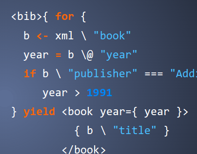
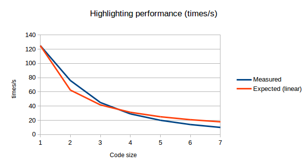

# Scala William's Sygments: Visual Pygments for Scala

## What is it?

Sygments is a syntax highlighting service and HTML5 app that uses Jython and [Pygments](http://pygments.org/).

Pygments is an excellent program syntax highlighter developed in Python.

Sygments lets you try different Pygments themes against a range of programming languages, including custom backgrounds.

It is especially suited for creating presentations.

See the demo at https://sygments.herokuapp.com/

## Sample

Here is a sample rendering. It looks lovely:



## What problem does it solve?

I originally created part of this application when working on the presentation of the [XML Processing in Scala paper](http://tinyurl.com/XMLLondon2014-XMLScala) I co-authored with [@fancellu](https://github.com/fancellu/).

Syntax highlighter themes do not work well with custom backgrounds. I had chosen a background in Google Presentations but it did not work nicely with IntelliJ's highlighting for XQuery and Scala.

1. Finding the right syntax highlighting theme for the background you've chosen

2. Highlighting your code so it is ready to be copy-and-pasted straight into Google Presentation or other targets

Out of the initial manual work, I created this nice usable app.

## Instructions

1. Install Java and SBT
2. run ```sbt play/run```
3. Go to (http://localhost:9000/)

### Reverse-proxying 

If you want to host this behind an nginx reverse proxy and need to configure a context path, then add the ```-DcontextPath=/some/place``` to the above line of code.

## Performance

Highlighter interface performance:



## Technology stack

  * sbt
  * Play 2.4
  * materialize-css
  * Jython
  * Scalatest

## Copyrights

Please refer to source material for copyright detail. The intention of this code is fair use, attributing authors via a web link.

Sygments back end code is available under the MIT license.
